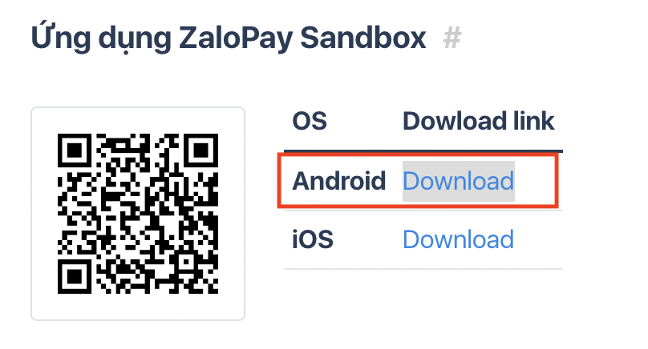
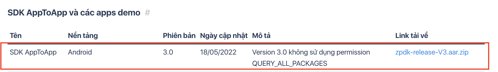
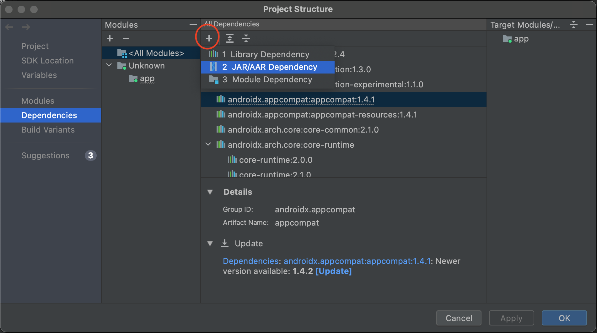
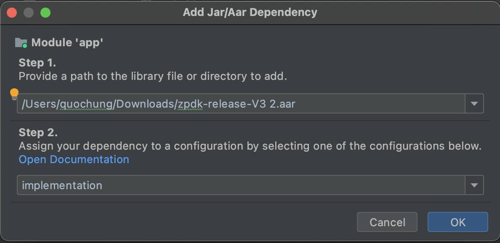

# Uit Trip
Uit Trip là ứng dụng giúp bạn đặt phòng hotel theo ngày . Ứng dụng  được  lấy ý  tưởng  từ các ứng dụng khác trên thị trường như Go2joy, Vntrip,..
## Chức năng
Ứng dụng này dành cho phía người dùng cuối:
- Tìm kiếm khách sạn theo các tỉnh thành ở Việt  Nam
- Lọc khách sạn, sắp xếp khách sạn
- Đặt phòng
- Thanh toán qua ZaloPay hoặc trả tại khách sạn
- Xem lịch sử đặt phòng
- Lưu các khách sạn yêu thích
- Tuỳ chọn ngôn ngữ (Anh, Việt)
- Xem các voucher mình sở hữu
- Xem thông báo
- Đánh giá khách sạn

Ứng dụng dành cho phía đối tác và admin
- [https://github.com/hungmai2411/UitTripPartner]

## Công nghệ
UitTrip là ứng dụng được viết bằng Java  và sử dụng Firebase làm database và một số thư viện hỗ trợ UI

## Cài đặt
Cài đặt Android Studio, link download: [https://developer.android.com/studio]

Tải ứng dụng Zalo Pay sand box và ZaloPay sdk, link download: [https://docs.zalopay.vn/v2/docs/apptoapp/demo.html]




Chọn vào File trong Android Studio -> Project Structure -> Dependencies



Import file .aar mới tải vào.



Trong file ```build.gradle``` có câu lệnh sau là chúng ta đã import thành công


Thanh toán Zalo Pay chỉ thực hiện được trên Real Device

Tải source code bằng câu lệnh
```sh
git clone https://github.com/hungmai2411/TravelApp.git
```

## Các thành viên trong nhóm
20521366-Mai Phạm Quốc Hưng ( Nhóm trưởng )

20521533 - Nguyễn Duy Linh

20520998 - Võ Đặng Thiện Khải

19522210 - Nguyễn Minh Thắng

## License
MIT


